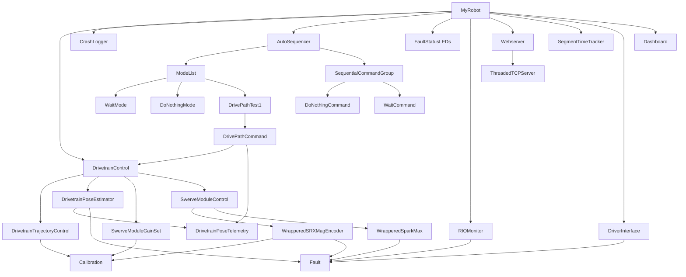

# Class Relationships

```mermaid
flowchart TD
    DrivetrainControl-->DrivetrainTrajectoryControl
    SequentialCommandGroup-->DoNothingCommand
    ModeList-->WaitMode
    DrivetrainPoseEstimator-->DrivetrainPoseTelemetry
    WrapperedSparkMax-->Fault
    MyRobot-->DrivetrainControl
    MyRobot-->CrashLogger
    DrivetrainPoseEstimator-->Fault
    MyRobot-->AutoSequencer
    DrivetrainControl-->DrivetrainPoseEstimator
    RIOMonitor-->Fault
    MyRobot-->FaultStatusLEDs
    DrivePathCommand-->DrivetrainControl
    SwerveModuleControl-->WrapperedSRXMagEncoder
    DrivePathTest1-->DrivePathCommand
    MyRobot-->RIOMonitor
    ModeList-->DoNothingMode
    WrapperedSRXMagEncoder-->Calibration
    MyRobot-->Webserver
    DriverInterface-->Fault
    Webserver-->ThreadedTCPServer
    MyRobot-->SegmentTimeTracker
    DrivetrainControl-->SwerveModuleGainSet
    SwerveModuleControl-->WrapperedSparkMax
    DrivetrainTrajectoryControl-->Calibration
    MyRobot-->DriverInterface
    AutoSequencer-->ModeList
    ModeList-->DrivePathTest1
    DrivetrainControl-->SwerveModuleControl
    AutoSequencer-->SequentialCommandGroup
    DrivePathCommand-->DrivetrainPoseTelemetry
    SwerveModuleGainSet-->Calibration
    SequentialCommandGroup-->WaitCommand
    MyRobot-->Dashboard
    WrapperedSRXMagEncoder-->Fault
```
