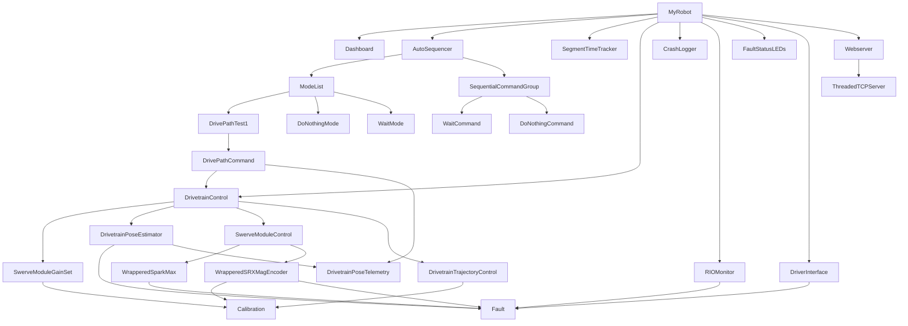

# Class Relationships

```mermaid
flowchart TD
    DrivePathTest1-->DrivePathCommand
    SwerveModuleControl-->WrapperedSparkMax
    RIOMonitor-->Fault
    WrapperedSRXMagEncoder-->Calibration
    WrapperedSRXMagEncoder-->Fault
    DrivetrainTrajectoryControl-->Calibration
    DrivetrainControl-->SwerveModuleGainSet
    AutoSequencer-->ModeList
    ModeList-->DrivePathTest1
    SequentialCommandGroup-->WaitCommand
    DrivetrainControl-->DrivetrainPoseEstimator
    ModeList-->DoNothingMode
    MyRobot-->Dashboard
    AutoSequencer-->SequentialCommandGroup
    MyRobot-->AutoSequencer
    DrivetrainPoseEstimator-->Fault
    SwerveModuleControl-->WrapperedSRXMagEncoder
    Webserver-->ThreadedTCPServer
    WrapperedSparkMax-->Fault
    DrivetrainControl-->SwerveModuleControl
    MyRobot-->SegmentTimeTracker
    DrivePathCommand-->DrivetrainControl
    MyRobot-->DrivetrainControl
    DriverInterface-->Fault
    ModeList-->WaitMode
    DrivePathCommand-->DrivetrainPoseTelemetry
    MyRobot-->CrashLogger
    SwerveModuleGainSet-->Calibration
    DrivetrainPoseEstimator-->DrivetrainPoseTelemetry
    MyRobot-->RIOMonitor
    SequentialCommandGroup-->DoNothingCommand
    MyRobot-->FaultStatusLEDs
    MyRobot-->DriverInterface
    DrivetrainControl-->DrivetrainTrajectoryControl
    MyRobot-->Webserver
```
