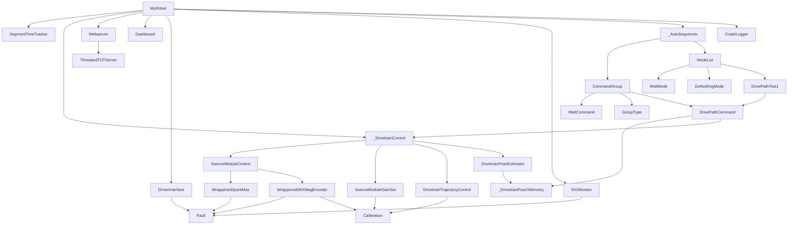

# Class Relationships

```mermaid
flowchart TD
    ModeList-->WaitMode
    DrivePathTest1-->DrivePathCommand
    MyRobot-->SegmentTimeTracker
    SwerveModuleGainSet-->Calibration
    MyRobot-->_DrivetrainControl
    MyRobot-->Webserver
    MyRobot-->Dashboard
    SwerveModuleControl-->WrapperedSparkMax
    SwerveModuleControl-->WrapperedSRXMagEncoder
    DrivetrainPoseEstimator-->_DrivetrainPoseTelemetry
    MyRobot-->DriverInterface
    CommandGroup-->WaitCommand
    MyRobot-->RIOMonitor
    _DrivetrainControl-->SwerveModuleControl
    CommandGroup-->GroupType
    RIOMonitor-->Fault
    _DrivetrainControl-->SwerveModuleGainSet
    DrivePathCommand-->_DrivetrainPoseTelemetry
    _DrivetrainControl-->DrivetrainTrajectoryControl
    DriverInterface-->Fault
    ModeList-->DoNothingMode
    CommandGroup-->DrivePathCommand
    WrapperedSRXMagEncoder-->Fault
    WrapperedSRXMagEncoder-->Calibration
    _AutoSequencer-->CommandGroup
    DrivetrainTrajectoryControl-->Calibration
    MyRobot-->_AutoSequencer
    MyRobot-->CrashLogger
    DrivePathCommand-->_DrivetrainControl
    Webserver-->ThreadedTCPServer
    _AutoSequencer-->ModeList
    ModeList-->DrivePathTest1
    _DrivetrainControl-->DrivetrainPoseEstimator
    WrapperedSparkMax-->Fault
```
