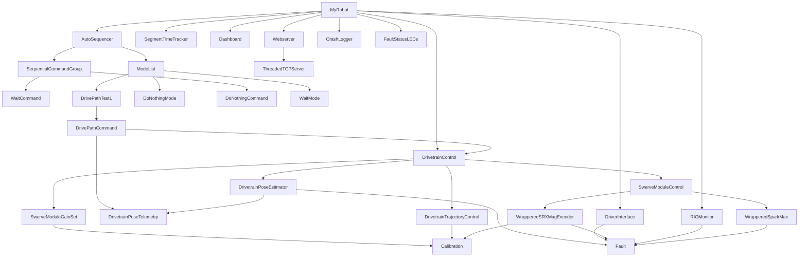

# Class Relationships

```mermaid
flowchart TD
    DrivetrainPoseEstimator-->Fault
    SequentialCommandGroup-->WaitCommand
    MyRobot-->Webserver
    MyRobot-->DrivetrainControl
    DriverInterface-->Fault
    DrivePathCommand-->DrivetrainPoseTelemetry
    SwerveModuleControl-->WrapperedSparkMax
    SwerveModuleGainSet-->Calibration
    SwerveModuleControl-->WrapperedSRXMagEncoder
    MyRobot-->SegmentTimeTracker
    DrivetrainTrajectoryControl-->Calibration
    MyRobot-->Dashboard
    DrivetrainControl-->DrivetrainTrajectoryControl
    DrivePathTest1-->DrivePathCommand
    ModeList-->DoNothingMode
    ModeList-->DrivePathTest1
    SequentialCommandGroup-->DoNothingCommand
    MyRobot-->AutoSequencer
    WrapperedSRXMagEncoder-->Fault
    DrivetrainControl-->DrivetrainPoseEstimator
    AutoSequencer-->ModeList
    RIOMonitor-->Fault
    MyRobot-->CrashLogger
    ModeList-->WaitMode
    AutoSequencer-->SequentialCommandGroup
    MyRobot-->FaultStatusLEDs
    MyRobot-->DriverInterface
    DrivetrainControl-->SwerveModuleControl
    WrapperedSparkMax-->Fault
    Webserver-->ThreadedTCPServer
    MyRobot-->RIOMonitor
    DrivetrainControl-->SwerveModuleGainSet
    WrapperedSRXMagEncoder-->Calibration
    DrivetrainPoseEstimator-->DrivetrainPoseTelemetry
    DrivePathCommand-->DrivetrainControl
```
